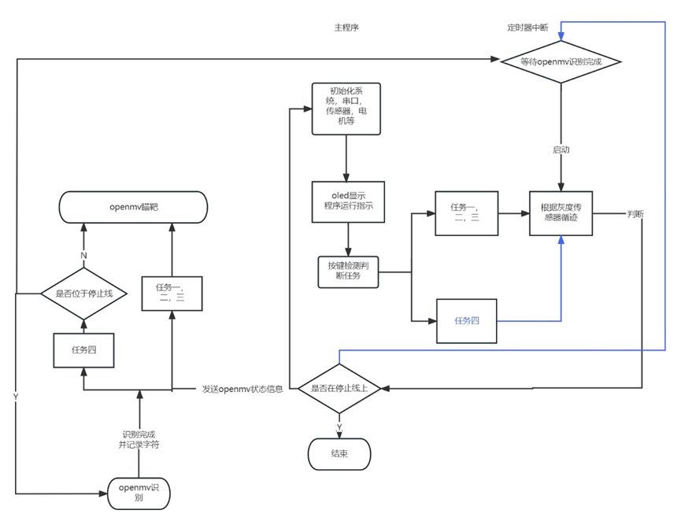
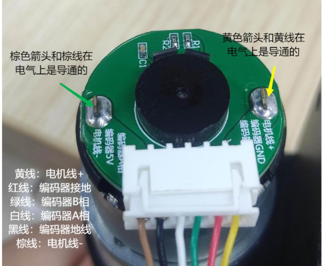

# Aim_Car
https://github.com/7yzx/Aim_Car/assets/86868727/4b260eed-c181-4432-9ec6-41e66c73d65f

---
我们设计了一辆以MSP432P401单片机为主控模块，通过带处理器的**OPENMV**模块进行目标数字和字母的识别，并且控制**二维舵机**的旋转。通过小车前方安装的五路**灰度循迹**模块识别地图中的黑线，并返回给单片机识别到黑线的位置。单片机通过位置的偏差，采用**PID闭环**控制算法，控制带有霍尔编码器的直流无刷电机的转向和转速。

---
### 总体介绍
msp432代码：
设计到的基础有：按键，定时器，串口，PWM发生器，LED，OLED，IO中断。我也将对所有的代码做一些解释以及相关的学习出处，方便之后学习和回顾。
代码框架：

- Control（控制有关程序）
  - 电机控制代码
  - pid代码
  - 灰度传感器代码
- hardware（初始化以及相关外设程序）
  - ...
  - ...
- Show(显示调试，串口和OLED)

##### 定时器(tim32.c)
msp432中定时器使用tim32定时器，fclk的频率是48MHZ，根据公式
$$T_{timer32} = \dfrac{CLKDIV * (ARR + 1)} { f_{clk}}$$
我这里选择是 10ms的中断，没有分频，CLKDIV=1，ARR=480000-1.
接下来就是在中断函数T32_INT1_IRQHandler() 中写程序了。
##### 串口(usart3.c)
msp432 有四个串口，这里的**串口0**可以直接通过usb线与串口助手通讯，支持printf函数。
**串口3**作为openmv数据接收，帧头2C，12；帧尾5B。
采用的方法是帧校验的方法，这种办法看起来有些繁琐，但是在数据的准确性保证是无误的，因此非常建议采用这样的办法。详解可以看**代码注释**。
在这里接收了三个标志位。
同时串口3也作为了串口发送函数，发送数组给openmv。

##### 电机驱动
我使用的是轮趣科技型号D153B的电机驱动模块。
四路电机引脚参考：
<table>
  <tr>
    <th>电机位置</th>
    <th>PWM信号引脚</th>
    <th>相位</th>
    <th>中断IO</th>
  </tr>
  <tr>
    <td>电机FL</td>
    <td>P2.4</td>
    <td>A相 B相</td>
    <td>P4.0 P4.2  P4.1 P4.3</td>
  </tr>
  <tr>
    <td>电机FR</td>
    <td>P2.5</td>
    <td>A相 B相</td>
    <td>P4.4 P4.5  P4.6 P4.7</td>
  </tr>
    <tr>
    <td>电机BL</td>
    <td>P2.6</td>
    <td>A相 B相</td>
    <td>P5.0 P5.1 P5.6 P5.7</td>
  </tr>
    <tr>
    <td>电机BR</td>
    <td>P2.7</td>
    <td>A相 B相</td>
    <td> P5.4 P5.5 P3.5 P3.7</td>
  </tr>
</table>

编码器电机基本都是这个结构，只用关注三个点
- 电机正负信号线，也就是两边的线。控制着电机正转，反转，以及停止
- 电源线
- 中间两个编码器反馈线，会有脉冲反馈，并且给单片机的IO口，读取高低电平中断就好了。

---
OPENMV端代码
get_number_and_servo.py 是该任务OPENMV端代码，包含了识别和追踪两个部分。
